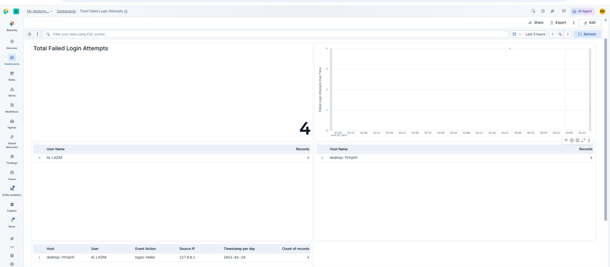
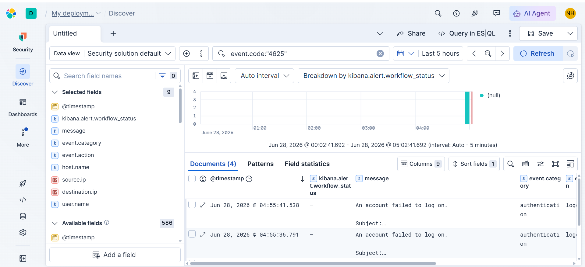
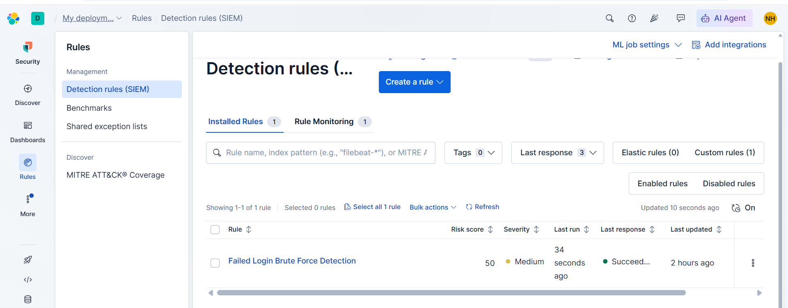
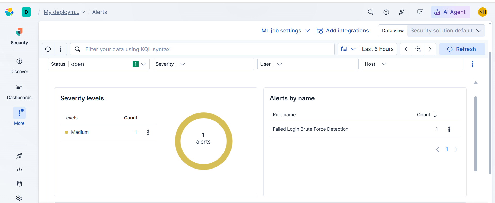

# Elastic SIEM – Windows Failed Login Detection

## Project Overview

This project demonstrates how to detect Windows failed logon attempts using **Elastic SIEM**, **Elastic Agent**, **Kibana**, and **KQL**.

A custom detection rule was created to identify repeated failed login attempts (Windows Event ID **4625**) that may indicate brute-force attacks or unauthorized authentication attempts.

---

## Objectives

* Collect Windows Security logs using Elastic Agent
* Detect failed logon events using KQL
* Build a security monitoring dashboard
* Create a threshold-based detection rule
* Generate and investigate security alerts

---

## Technologies Used

* Elastic SIEM
* Kibana
* Elastic Agent
* Windows Security Logs
* Kibana Query Language (KQL)

---

## KQL Query

```kql
event.code:"4625"
```

---

## Detection Rule

| Setting    | Value                    |
| ---------- | ------------------------ |
| Rule Type  | Threshold                |
| Query      | `event.code:"4625"`      |
| Group By   | `host.name`              |
| Threshold  | 2 failed logins per host |
| Severity   | Medium                   |
| Risk Score | 50                       |

---

## Dashboard

The dashboard includes:

* Total Failed Login Attempts
* Failed Login Attempts Over Time
* Top Targeted User Accounts
* Top Affected Hosts
* Failed Login Events Table

---

## Project Screenshots

### Dashboard



### Discover - Failed Login Events



### Detection Rule



### Alert Generated



---

## Skills Demonstrated

* Security Monitoring
* SIEM Operations
* Log Analysis
* Windows Event Analysis
* KQL Query Writing
* Detection Engineering
* Dashboard Creation
* Alert Investigation

---

## Future Improvements

* Detect failed logins from multiple source IPs
* Correlate successful logins after brute-force attempts
* Add MITRE ATT&CK mapping
* Expand detection coverage for additional Windows security events

---

## Author

**Noor-ul-Huda (hudanoor-01)**

